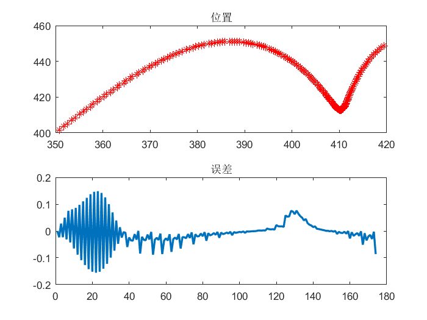
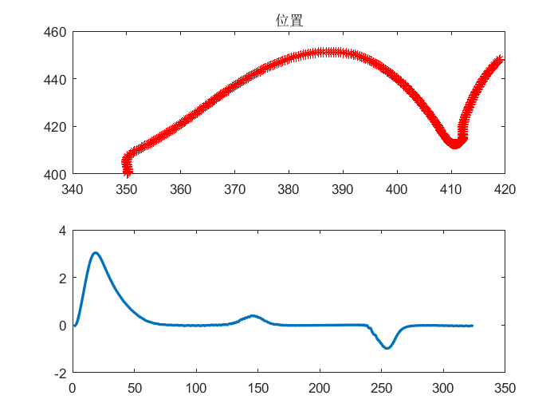
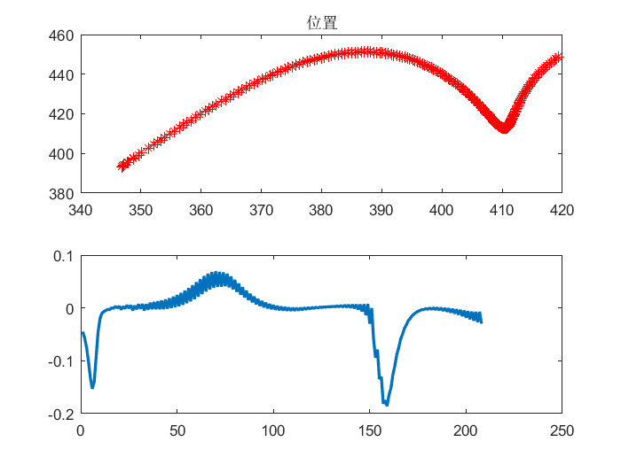

# 基于MPC的轨迹跟踪控制
移动机器人模型： 

首先使用贝塞尔曲线生成一条路径

然后分别使用了一阶、二阶、三阶的MPC跟踪生成的路径

### 一阶MPC	

在进行MPC模型推导时，只考虑对U的限制，所得轨迹跟踪图与误差图如下：

### 二阶MPC

在进行MPC模型推导时，不仅考虑对U的限制，还考虑对dU的限制，所得轨迹跟踪图与误差图如下：

### 三阶MPC

在进行MPC模型推导时，不仅考虑对U的限制，对dU的限制，还考虑对ddU的限制，所得轨迹跟踪图与误差图如下：

## 鸣谢
- 此程序为在[仙工智能 SEER](https://github.com/seer-robotics/)实习期间完成(2021年暑假)，感谢[黄强盛老师](https://github.com/huangqiangsheng)在期间的指导。